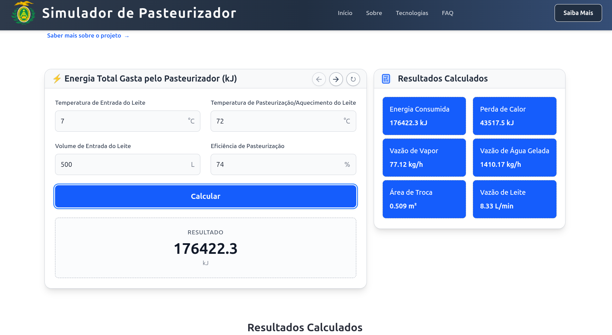

<div align="center">
    <h1>
    Pasteurizador
    </h1>
    
</div>
<br>
Este projeto consiste em uma SPA 100% client-side otimizada e completa de um simulador de pasteurizador de leite, sendo um conjunto de fórmulas matemáticas que dado os corretos parâmetros fornecem resultados elucidadores e importanssímos para considerar a operação de um pasteurizador, como a energia total gasta que está relacionada ao custo etc. 

## Dependências
Segue abaixo a lista das dependências e frameworks primárias do projeto.

- Vue
- Vite
- Typescript
- Tailwind
- Pinia
- VueRouter
- VueFire
- Katex, Toastify, AOS, Zod

## Passos iniciais

### Setup do projeto
O projeto foi configurado e montado para o uso do framework `Vue` com a ferramenta de Build `Vite`:
```
npm creat vite@latest pasteurizer -- --template vue
```
Instação das dependências principais:
```
npm install vue-router pinia axios path
```
tailwind
```
npm install tailwindcss @tailwindcss/vite
```
```
```

### Comandos iniciais
- Instalar dependência
```
npm install
```
- Executar o projeto em modo de desenvolvimento com hot-reload
```
npm run dev
```
